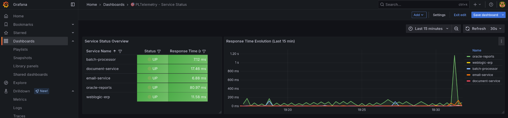
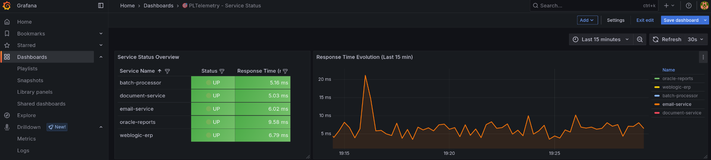
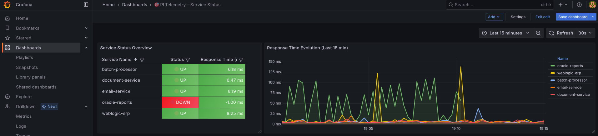

# PLTelemetry Heartbeat Monitoring System

> **Enterprise-grade service health monitoring for Oracle environments with OpenTelemetry integration**

A production-ready Oracle PL/SQL package that provides automated service health monitoring with intelligent escalation policies, real-time metrics export, and seamless integration with modern observability platforms.

<p align="center">
  
</p>

<p align="center">
  
</p>

<p align="center">
  
</p>

## Overview

This system monitors multiple services with configurable health checks, escalation policies, and automatic alerting. It leverages PLTelemetry to export OpenTelemetry-compatible metrics to Grafana, Tempo, and notification systems like Microsoft Teams or email.

**Key Features:**
- **Dynamic Service Discovery**: Services are automatically discovered from database configuration
- **Intelligent Escalation**: Configurable failure thresholds per criticality level
- **Clean Metrics Export**: Uses -1ms for DOWN services instead of artificial timeout values
- **Real-time Dashboards**: Auto-updating Grafana dashboards with service status and response times
- **Multi-channel Alerting**: Email and Microsoft Teams integration
- **OpenTelemetry Compatible**: Standard OTLP format for enterprise observability stacks

## Architecture

```
Service Endpoints → PL/SQL Health Checker → PLTelemetry → OTLP Bridge → Observability Stack
                                              ↓                         ↓
                                         Oracle Tables              Grafana/Tempo
                                              ↓                         ↓
                                         Alert Logic              Teams/Email
```

**Data Flow:**
1. Oracle PL/SQL performs HTTP health checks against configured service endpoints
2. Results are stored in Oracle tables and exported as OpenTelemetry metrics
3. Grafana consumes metrics via Prometheus/OTLP for visualization
4. Alert rules trigger notifications based on escalation levels

## Prerequisites

### Database Requirements
- Oracle Database 11g+ (12c+ recommended for optimal JSON performance)
- PLTelemetry core package installed
- Required privileges: `UTL_HTTP`, `DBMS_CRYPTO`, `CREATE TABLE`, `CREATE PROCEDURE`

### Network Configuration
```sql
-- Required ACL for outbound HTTP calls
BEGIN
  DBMS_NETWORK_ACL_ADMIN.CREATE_ACL(
    acl => 'heartbeat_monitor_acl.xml',
    description => 'Heartbeat Monitor HTTP Access',
    principal => 'YOUR_SCHEMA',
    is_grant => TRUE,
    privilege => 'connect'
  );
  
  DBMS_NETWORK_ACL_ADMIN.ASSIGN_ACL(
    acl => 'heartbeat_monitor_acl.xml',
    host => '*'  -- Or specific service hosts
  );
END;
/
```

### Observability Stack
- Grafana with Prometheus data source
- OpenTelemetry Collector (if using OTLP bridge)
- Email server or Microsoft Teams webhook (for alerting)

## Installation

### 1. Database Setup

```sql
-- Install core tables
@install/heartbeat_tables.sql

-- Install PLTelemetry core (if not already installed)
@PLTelemetry.pks
@PLTelemetry.pkb

-- Install heartbeat monitoring package
@HEARTBEAT_MONITOR.pks
@HEARTBEAT_MONITOR.pkb
```

### 2. Configuration

```sql
-- Configure PLTelemetry backend
BEGIN
    PLTelemetry.set_backend_url('OTLP_BRIDGE');
    PLT_OTLP_BRIDGE.set_otlp_collector('http://your-collector:4318');
    PLT_OTLP_BRIDGE.set_service_info('heartbeat-monitor', '1.0.0');
END;
/
```

### 3. Service Registration

```sql
-- Add services to monitor
BEGIN
    HEARTBEAT_MONITOR.add_service(
        p_service_name => 'weblogic-erp',
        p_description => 'Main ERP Application',
        p_endpoint_url => 'http://erp-server:8002',
        p_criticality_code => 'HIGH',
        p_timeout_seconds => 10
    );
    
    HEARTBEAT_MONITOR.add_service(
        p_service_name => 'email-service',
        p_description => 'Email Notification Service',
        p_endpoint_url => 'http://email-server:8003',
        p_criticality_code => 'MEDIUM',
        p_timeout_seconds => 15
    );
END;
/
```

## Configuration Reference

### Criticality Levels

The system supports configurable criticality levels with different escalation policies:

| Criticality | Check Interval | Max Failures | Escalation Multiplier |
|-------------|---------------|--------------|---------------------|
| HIGH        | 1 minute      | 3            | 2x                  |
| MEDIUM      | 5 minutes     | 5            | 2x                  |
| LOW         | 15 minutes    | 10           | 1.5x                |

### Health Check Process

1. **HTTP Request**: GET `{endpoint_url}/health`
2. **Response Analysis**: 200 OK = Healthy, others = Unhealthy
3. **Escalation Logic**: Consecutive failures trigger escalation levels
4. **Metric Export**: All results exported as OpenTelemetry metrics

### Exported Metrics

```
pltelemetry_service_status_gauge{service_name="weblogic-erp"} 1           # 1=UP, 0=DOWN
pltelemetry_service_response_time_ms{service_name="weblogic-erp"} 8.5     # -1 for DOWN services
pltelemetry_service_consecutive_failures_count{service_name="weblogic-erp"} 0
pltelemetry_service_escalation_level{service_name="weblogic-erp"} 0       # 0=OK, 1=Warning, 2=Critical
```

## Grafana Integration

### Dashboard Import

Use the provided script to create a dynamic dashboard:

```bash
#!/bin/bash
./import_dashboard.sh
```

**Dashboard Features:**
- **Service Status Table**: Shows all services with real-time status, response times, and criticality
- **Response Time Chart**: 15-minute evolution graph (excludes DOWN services for clean visualization)
- **Auto-refresh**: Updates every 30 seconds
- **Dynamic Service Discovery**: New services appear automatically

### Alert Configuration

The system provides two alert levels based on escalation:

1. **Warning Alert**: `pltelemetry_service_escalation_level >= 1`
2. **Critical Alert**: `pltelemetry_service_escalation_level >= 2`

Alerts respect the business logic configured in `heartbeat_criticality_levels.max_escalation_failures`.

## Production Considerations

### Performance Impact

- **Minimal Database Overhead**: Designed for production use
- **Async Processing**: Optional asynchronous metric export
- **Efficient Querying**: Indexes provided for optimal performance
- **Error Isolation**: Telemetry failures never affect business logic

### Scalability

- **Dynamic Service Addition**: Services can be added/removed without code changes
- **Configurable Intervals**: Adjust check frequency per criticality level
- **Batch Processing**: Efficient processing of multiple services
- **Resource Management**: Automatic cleanup of temporary objects

### Monitoring the Monitor

The system includes self-monitoring capabilities:

```sql
-- View recent errors
SELECT error_time, error_message, module_name 
FROM plt_telemetry_errors 
WHERE module_name = 'HEARTBEAT_MONITOR'
ORDER BY error_time DESC;

-- Check queue status (if using async mode)
SELECT COUNT(*) as pending_exports 
FROM plt_queue 
WHERE processed = 'N';
```

## API Reference

### Core Functions

```sql
-- Perform manual health check
l_result := HEARTBEAT_MONITOR.check_service_health('service-name');

-- Add new service
HEARTBEAT_MONITOR.add_service(
    p_service_name => 'api-gateway',
    p_description => 'Main API Gateway', 
    p_endpoint_url => 'http://gateway:8080',
    p_criticality_code => 'HIGH'
);

-- Get service runtime information
l_runtime := HEARTBEAT_MONITOR.get_service_runtime('service-name');

-- Run monitoring cycle (typically scheduled)
HEARTBEAT_MONITOR.perform_heartbeat_checks();
```

### Scheduled Execution

```sql
-- Create job for automated monitoring
BEGIN
  DBMS_SCHEDULER.CREATE_JOB(
    job_name => 'HEARTBEAT_MONITOR_JOB',
    job_type => 'PLSQL_BLOCK',
    job_action => 'BEGIN HEARTBEAT_MONITOR.perform_heartbeat_checks(); END;',
    start_date => SYSTIMESTAMP,
    repeat_interval => 'FREQ=MINUTELY;INTERVAL=1',
    enabled => TRUE
  );
END;
/
```

## Troubleshooting

### Common Issues

**Connection Refused Errors:**
- Verify network ACLs are configured for target hosts
- Check service endpoint availability
- Confirm firewall rules allow outbound HTTP traffic

**Metrics Not Appearing in Grafana:**
- Verify PLTelemetry configuration and collector endpoint
- Check OTLP collector logs for received data
- Confirm Prometheus scraping configuration

**High Response Times (99999ms):**
- Upgrade to the fixed package body (uses -1ms for DOWN services)
- Check service timeout configuration
- Review network latency between Oracle and service endpoints

### Debug Mode

```sql
-- Enable detailed logging
PLT_OTLP_BRIDGE.set_debug_mode(TRUE);

-- Monitor telemetry errors
SELECT * FROM plt_telemetry_errors 
WHERE error_time > SYSDATE - 1/24
ORDER BY error_time DESC;
```

## Data Retention

Configure appropriate retention policies for production use:

```sql
-- Clean old queue entries (example)
DELETE FROM plt_queue 
WHERE processed = 'Y' 
  AND processed_time < SYSDATE - 7;

-- Archive old error logs
DELETE FROM plt_telemetry_errors 
WHERE error_time < SYSDATE - 30;
```

## Security Considerations

- **Network Security**: Ensure proper firewall rules for outbound HTTP calls
- **Authentication**: Consider API keys or certificates for service endpoints
- **Data Protection**: Monitor for sensitive data in error logs
- **Access Control**: Restrict access to monitoring tables and procedures

## Contributing

When extending the system:

1. **Maintain Metric Stability**: Avoid changing label names in existing metrics
2. **Error Handling**: All telemetry operations must be fail-safe
3. **Performance**: Consider impact on database performance
4. **Documentation**: Update this README for significant changes

## License

This implementation is provided as part of the PLTelemetry project under the MIT License.

---

**PLTelemetry Heartbeat Monitoring System** - Enterprise service monitoring for Oracle environments.