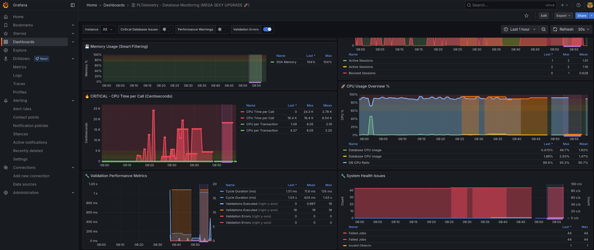
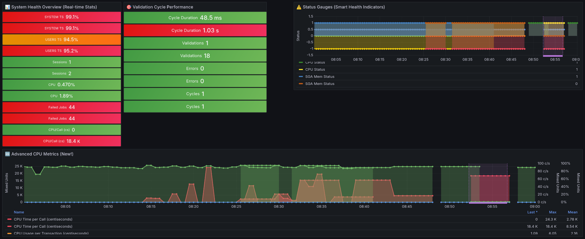
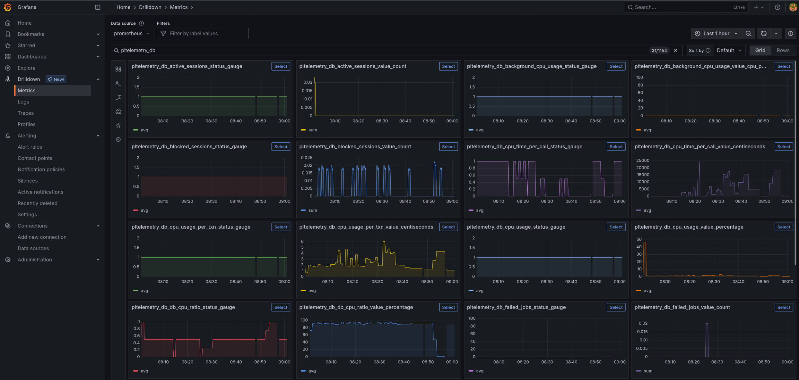
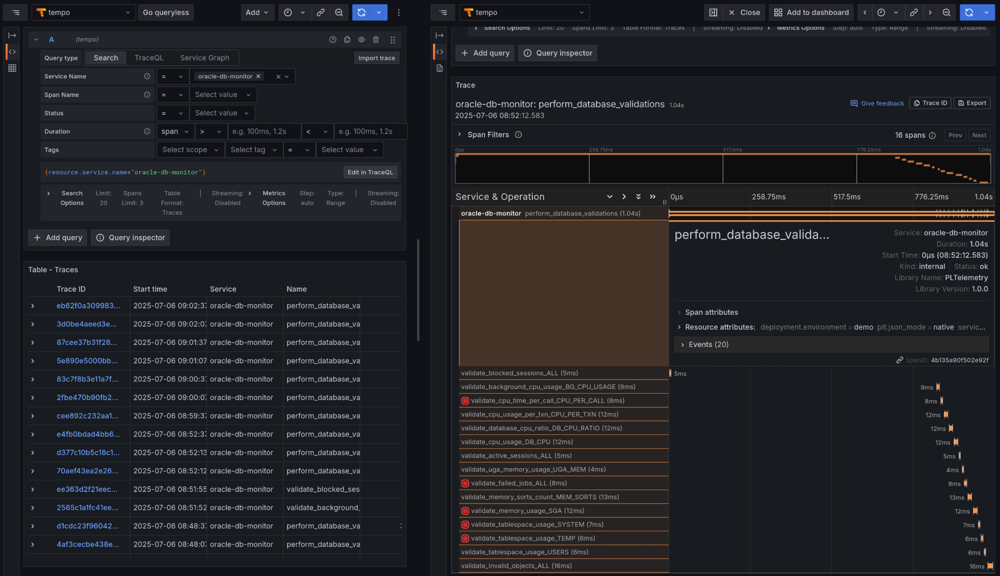

PLT_DB_MONITOR

Table-driven database monitoring system for Oracle using PLTelemetry

PLT_DB_MONITOR is a configurable database monitoring solution that demonstrates PLTelemetry's capabilities for Oracle database observability. It provides a flexible alternative to Oracle Enterprise Manager with custom alerting, multi-tenant support, and integration with modern observability stacks.
What It Does
PLT_DB_MONITOR monitors Oracle database health using a table-driven configuration approach. Instead of hardcoded checks, you configure what to monitor, when to monitor it, and what thresholds to use - all stored in database tables.


<p align="center">
  
</p>

<p align="center">
  
</p>

<p align="center">
  
</p>

<p align="center">
  
</p>


## What It Does

PLT_DB_MONITOR monitors Oracle database health using a table-driven configuration approach. Instead of hardcoded checks, you configure what to monitor, when to monitor it, and what thresholds to use - all stored in database tables.

**Key Features:**
- **Configurable monitoring** - Define custom validations through database tables
- **Multi-environment support** - Different thresholds for PROD/TEST/DEV
- **Multi-tenant capable** - Monitor multiple databases from a single instance
- **Modern observability** - Integrates with Grafana, Tempo, Prometheus
- **Cost effective** - Open source alternative to Oracle EM
- **Granular control** - Enable/disable individual checks per environment

## Architecture

```
Oracle Database → PLT_DB_MONITOR → PLTelemetry → OTLP Bridge → Grafana Stack
                      ↓
             Configuration Tables:
             • db_validation_types
             • db_validation_rules  
             • db_validation_instances
```

## Prerequisites

- [PLTelemetry core](../../../) installed and configured
- [PLT_OTLP_BRIDGE](../OTLP/) installed and configured
- Oracle Database 12c+ (23ai features available with newer versions)
- DBA privileges for monitoring views (`V$SESSION`, `DBA_TABLESPACES`, etc.)
- Grafana + Tempo + Prometheus stack (optional, but recommended)

## Quick Start

### 1. Install Dependencies

```sql
-- Ensure PLTelemetry and OTLP Bridge are installed first
SELECT 'PLTelemetry' FROM dual WHERE EXISTS (SELECT 1 FROM user_objects WHERE object_name = 'PLTELEMETRY');
SELECT 'OTLP Bridge' FROM dual WHERE EXISTS (SELECT 1 FROM user_objects WHERE object_name = 'PLT_OTLP_BRIDGE');
```

### 2. Grant Required Privileges

```sql
-- Run as SYS in target PDB
GRANT SELECT ON v_$session TO your_user;
GRANT SELECT ON v_$sysmetric TO your_user;
GRANT SELECT ON dba_tablespaces TO your_user;
GRANT SELECT ON dba_free_space TO your_user;
GRANT SELECT ON dba_objects TO your_user;
GRANT SELECT ON dba_scheduler_job_run_details TO your_user;
GRANT CREATE JOB TO your_user;

-- See Run_Grants.sql for complete list
```

### 3. Install PLT_DB_MONITOR

```sql
-- 1. Create tables
@PLT_DB_MONITOR_DDL.sql

-- 2. Insert configuration data
@PLT_DB_MONITOR_DML.sql

-- 3. Create package
@PLT_DB_MONITOR.pks
@PLT_DB_MONITOR.pkb
```

### 4. Configure and Test

```sql
-- Configure telemetry (required)
BEGIN
    PLT_DB_MONITOR.configure_telemetry();
    DBMS_OUTPUT.PUT_LINE('Environment: ' || PLT_DB_MONITOR.detect_environment());
END;
/

-- Enable specific validations you want to monitor
UPDATE db_validation_instances 
SET is_enabled = 1 
WHERE instance_name IN ('SYSTEM_TABLESPACE', 'USERS_TABLESPACE', 'GLOBAL_ACTIVE_SESSIONS');

-- Test manually
BEGIN
    PLT_DB_MONITOR.perform_database_validations(p_force_all_checks => TRUE);
END;
/
```

### 5. Set Up Automated Monitoring

```sql
-- Create scheduled job for continuous monitoring
@create_job.sql
```

## Configuration

### Validation Types

The system comes with pre-configured validation types:

- **TABLESPACE_USAGE** - Monitor tablespace usage percentages
- **ACTIVE_SESSIONS** - Track active session counts
- **BLOCKED_SESSIONS** - Monitor blocked sessions
- **INVALID_OBJECTS** - Count invalid database objects
- **FAILED_JOBS** - Track failed scheduler jobs
- **MEMORY_USAGE** - Monitor SGA/PGA memory usage
- **CPU_USAGE** - Track CPU utilization
- **CPU_TIME_PER_CALL** - Oracle 23ai advanced CPU metrics
- **DB_CPU_RATIO** - Oracle 23ai database CPU ratio

### Environment-Specific Thresholds

Configure different thresholds per environment:

```sql
-- Example: Tablespace usage thresholds
-- PROD: Warning 85%, Critical 95%
-- TEST: Warning 90%, Critical 98%

SELECT 
    validation_type_code,
    environment_name,
    warning_threshold,
    critical_threshold,
    threshold_unit
FROM db_validation_rules
WHERE validation_type_code = 'TABLESPACE_USAGE';
```

### Adding Custom Validations

1. **Add validation type:**
```sql
INSERT INTO db_validation_types (
    validation_type_code, description, validation_procedure
) VALUES (
    'CUSTOM_CHECK', 'My custom validation', 'validate_custom_check'
);
```

2. **Configure thresholds:**
```sql
INSERT INTO db_validation_rules (
    validation_type_code, environment_name, 
    warning_threshold, critical_threshold, threshold_unit
) VALUES (
    'CUSTOM_CHECK', 'PROD', 10, 50, 'count'
);
```

3. **Create instances:**
```sql
INSERT INTO db_validation_instances (
    validation_type_code, instance_name, 
    target_identifier, is_enabled
) VALUES (
    'CUSTOM_CHECK', 'MY_CUSTOM_INSTANCE', 'TARGET_ID', 1
);
```

4. **Implement validation function in PLT_DB_MONITOR package**

## Observability Integration

### Metrics Generated

All validations generate standardized metrics:
- `db_{validation_type}_value_{unit}` - Actual measured values
- `db_{validation_type}_status_gauge` - Health status (1=OK, 0.5=WARNING, 0=CRITICAL, -1=ERROR)
- `db_validation_check_performed` - Check execution counter
- `db_validation_cycle_duration_ms` - Monitoring cycle performance

### Grafana Dashboards

Import pre-built dashboards:
```bash
./import_dashboard.sh admin          # Comprehensive dashboard
./import_dashboard_lite.sh admin     # Simplified trends view
```

### Distributed Tracing

Each monitoring cycle creates distributed traces visible in Tempo:
- **Trace name:** `database_validation_cycle`
- **Spans:** Individual validation checks with performance metrics
- **Events:** Validation results and status changes

## Multi-Tenant Usage

Monitor multiple environments from a single installation:

```sql
-- Configure different service names per tenant
PLT_OTLP_BRIDGE.set_service_info('oracle-db-tenant-a', '1.0.0', 'tenant_a');

-- Use environment detection for automatic configuration
SELECT PLT_DB_MONITOR.detect_environment() FROM dual;
-- Returns: PROD, TEST, or DEV based on database name
```

## Production Deployment

### Recommended Job Schedule

```sql
-- Production: Every 5 minutes
repeat_interval => 'FREQ=MINUTELY;INTERVAL=5'

-- Development: Every 30 seconds (for testing)
repeat_interval => 'FREQ=SECONDLY;INTERVAL=30'
```

### Performance Considerations

- **Async mode** recommended for production: `PLTelemetry.set_async_mode(TRUE)`
- **Selective monitoring**: Enable only necessary validations
- **Appropriate intervals**: 1-5 minutes for most checks, daily for certificate validations

## Troubleshooting

### Common Issues

**No metrics in Grafana:**
```sql
-- Verify telemetry configuration
SELECT PLTelemetry.get_backend_url() FROM dual;
-- Should return: OTLP_BRIDGE

-- Check enabled validations
SELECT COUNT(*) FROM db_validation_instances WHERE is_enabled = 1;
-- Should be > 0
```

**Validation errors:**
```sql
-- Check validation status
SELECT instance_name, last_check_status, last_check_time
FROM db_validation_instances
WHERE last_check_status = 'ERROR'
ORDER BY last_check_time DESC;

-- Check PLTelemetry errors
SELECT error_time, error_message, module_name
FROM plt_telemetry_errors
WHERE module_name = 'PLT_DB_MONITOR'
ORDER BY error_time DESC;
```

**Oracle 23ai metrics not working:**
```sql
-- Check available metrics
SELECT DISTINCT metric_name 
FROM v$metric 
WHERE UPPER(metric_name) LIKE '%CPU%'
ORDER BY metric_name;

-- Verify privileges
SELECT COUNT(*) FROM v$metric WHERE ROWNUM = 1;
-- Should return 1 if privileges are correct
```

### Monitoring the Monitor

```sql
-- Check job execution
SELECT job_name, state, last_start_date, next_run_date, run_count
FROM user_scheduler_jobs 
WHERE job_name LIKE 'PLT_%'
ORDER BY next_run_date;

-- Manual execution for testing
EXEC PLT_DB_MONITOR.perform_database_validations(TRUE);
```

## Oracle Version Compatibility

- **Oracle 12c+**: Core functionality available
- **Oracle 18c+**: Enhanced JSON processing
- **Oracle 23ai**: Advanced CPU metrics using `V$METRIC` views
- **Earlier versions**: Manual adaptation of queries required

Note: Oracle 23ai metrics are used for convenience, but the system can be adapted for any Oracle version by modifying the validation queries.

## Benefits vs Oracle Enterprise Manager

| Feature | Oracle EM | PLT_DB_MONITOR |
|---------|-----------|----------------|
| **Cost** | Licensed product | Free, open source |
| **Customization** | Limited | Fully configurable |
| **Modern Stack** | Proprietary | Grafana/Prometheus/Tempo |
| **Multi-tenant** | Complex setup | Built-in support |
| **Alerting** | EM-specific | Industry standard (Grafana alerts) |
| **Data Retention** | Limited | Configurable |
| **Integration** | EM ecosystem | Open observability standards |

## Contributing

This is a demonstration of PLTelemetry capabilities. To extend:

1. **Add new validation types** in `db_validation_types`
2. **Implement validation functions** in PLT_DB_MONITOR package
3. **Configure environment-specific rules** in `db_validation_rules`
4. **Create Grafana panels** for new metrics

## License

Same as PLTelemetry core - MIT License.

---

**PLT_DB_MONITOR** - Demonstrating configurable database monitoring with PLTelemetry.

*Modern observability • Configurable thresholds • Multi-tenant • Cost effective*