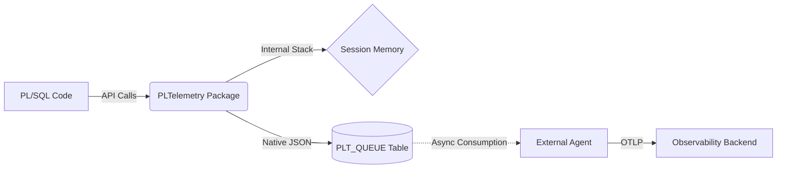

¡Claro que sí! Tienes toda la razón, copiar texto renderizado es un infierno.

Aquí tienes el **código fuente crudo** del `README.md`.

Solo tienes que darle al botón de **"Copiar"** que aparece arriba a la derecha de este bloque negro, pegarlo en tu editor de texto favorito y guardarlo como `README.md`.

```markdown
# PLTelemetry V2 (Lean Edition)

**A lightweight, asynchronous OpenTelemetry SDK for Oracle PL/SQL.**

PLTelemetry allows legacy Oracle databases to participate in modern distributed tracing. It is designed with one goal: **zero impact on business transaction latency.**

Instead of making synchronous HTTP calls to an OTLP collector (which blocks the PL/SQL execution), this SDK writes telemetry data as pre-formatted JSON into a local high-performance queue table. An external agent (Go/Rust/Java) is responsible for reading this queue and pushing it to observability platforms like Grafana, Jaeger, or Datadog.

## Core Philosophy

1.  **Asynchronous:** "Fire and forget." The PL/SQL code writes to a local table and moves on.
2.  **Stateful:** Uses Oracle Session Memory (Package Variables) to manage span nesting and context automatically.
3.  **Multi-Tenant:** Built from the ground up to segregate data by tenant ID.
4.  **Standard:** Generates OpenTelemetry-compatible JSON structures natively.

## Architecture



## Installation

The installation is scripted and dependency-aware.

1. Connect to your Oracle Database (12.2 or higher recommended for Native JSON).
2. Run the installer:

```sql
@install.sql

```

*This will drop any V1 tables, create the new V2 schema (Queue, Config, Errors), and compile the packages.*

## Usage Guide

### 1. Initialization (Multi-Tenancy)

Always start by defining the context. This ensures all subsequent data is tagged correctly.

```sql
BEGIN
    -- If you don't set this, it defaults to 'default'
    PLTelemetry.set_tenant('ACME_CORP');
END;
/

```

### 2. Tracing (Nested Spans)

The SDK uses an internal LIFO stack to manage parent-child relationships. You don't need to pass IDs around; just open and close spans.

```sql
DECLARE
    l_waste VARCHAR2(100); -- To capture the function return
BEGIN
    -- 1. Root Span
    l_waste := PLTelemetry.start_span('process_order');
    
        -- 2. Nested Span (Automatically linked to process_order)
        l_waste := PLTelemetry.start_span('validate_stock');
            -- Simulate work
            DBMS_LOCK.SLEEP(0.1);
        PLTelemetry.end_span('OK'); -- Closes validate_stock

        -- 3. Another Nested Span
        l_waste := PLTelemetry.start_span('charge_credit_card');
            -- Log inside a span (Automatically correlated)
            PLTelemetry.log('INFO', 'Contacting payment gateway...');
        PLTelemetry.end_span('OK'); -- Closes charge_credit_card

    -- Close Root Span
    PLTelemetry.end_span('OK', 'Order processed successfully');
    
    COMMIT; -- Persist to Queue
END;
/

```

### 3. Logs

Logs are automatically correlated with the active span. If no span is active, they are recorded as standalone events.

```sql
-- Simple Log
PLTelemetry.log('INFO', 'System startup complete');

-- Log with Attributes (Context)
DECLARE
    l_attrs PLTelemetry.t_attributes;
BEGIN
    l_attrs(1).key := 'user_id';   l_attrs(1).value := '1001';
    l_attrs(2).key := 'module';    l_attrs(2).value := 'billing';
    
    PLTelemetry.log('ERROR', 'Payment failed', l_attrs);
END;
/

```

### 4. Metrics (Typed)

It is crucial to distinguish between **Gauges** (absolute values) and **Counters** (deltas) for correct visualization.

```sql
-- GAUGE: An absolute value at a specific point in time.
-- Example: CPU usage, Memory, Disk Space, Temperature.
PLTelemetry.log_metric(
    p_name  => 'db.tablespace.used_pct',
    p_value => 85.5,
    p_type  => PLTelemetry.C_METRIC_GAUGE,
    p_unit  => '%'
);

-- COUNTER: A delta value to be added to a total.
-- Example: Number of requests, Errors, Bytes processed.
PLTelemetry.log_metric(
    p_name  => 'app.orders.count',
    p_value => 1, -- Increment by 1
    p_type  => PLTelemetry.C_METRIC_COUNTER,
    p_unit  => '1'
);

```

## Data Internals

All data is stored in the `PLT_QUEUE` table waiting for the agent.

| Column | Description |
| --- | --- |
| `ID` | Identity / Sequence. |
| `ITEM_TYPE` | `TRACE`, `METRIC`, or `LOG`. |
| `PAYLOAD` | The OTLP-ready JSON (CLOB). |
| `TENANT_ID` | For partitioning and filtering by the consumer agent. |
| `STATUS` | `NEW` (Ready), `PROCESSING`, `FAILED`. |

**Debugging:**
If something goes wrong inside the package (e.g., JSON generation error), it catches the exception and logs it to `PLT_TELEMETRY_ERRORS` using an autonomous transaction, so your business logic never fails due to observability issues.

## License

MIT License.

```

```